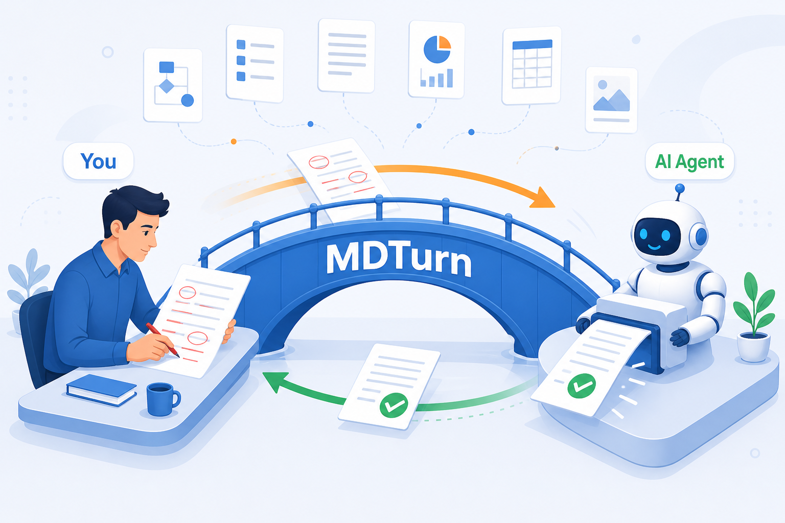
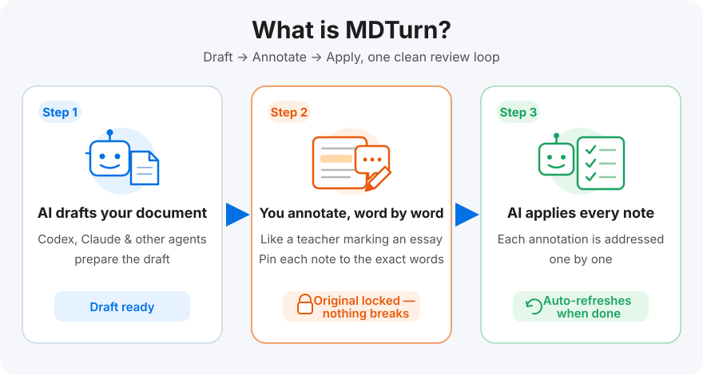
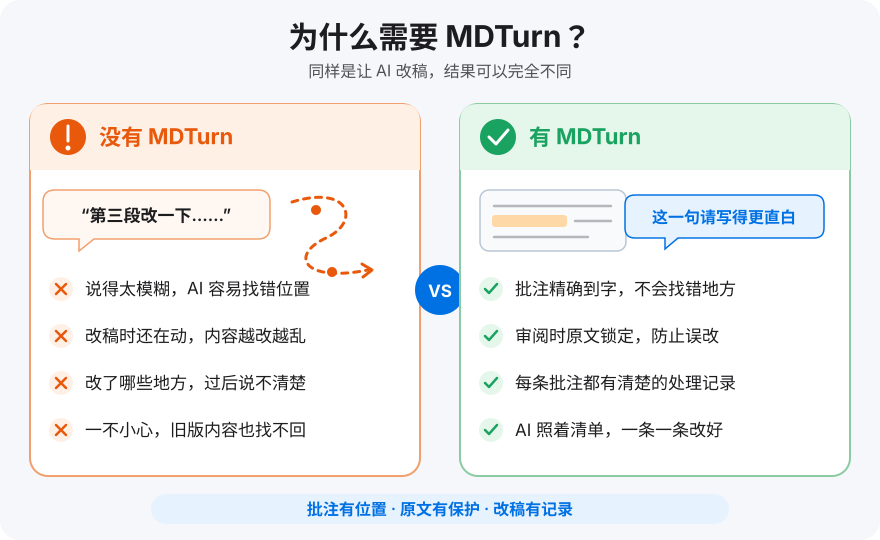
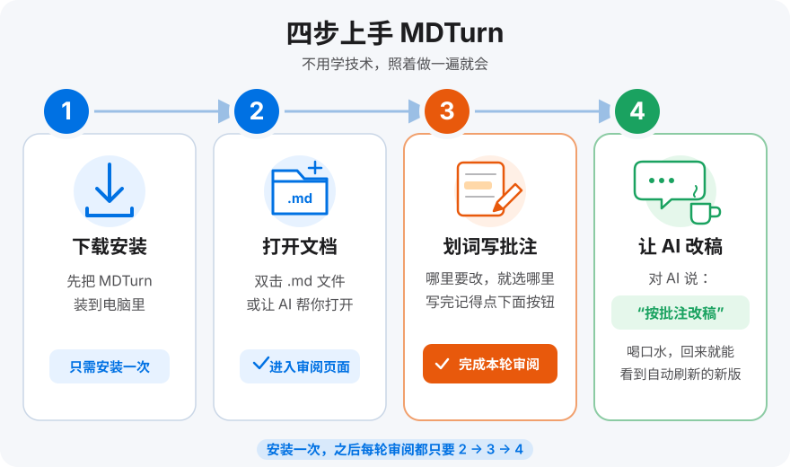
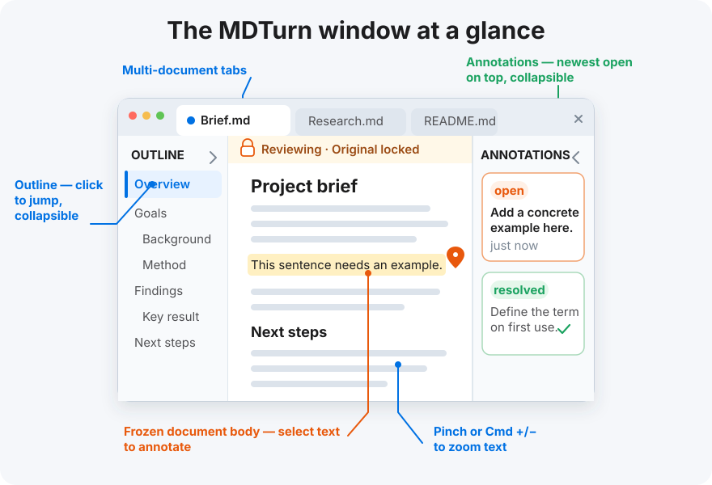

# MDTurn

**The bridge between you and your AI agent.** · **你和 AI 智能体之间的协作桥梁。**

Your agent hands you finished work all day long — project proposals, execution plans, research reports. In MDTurn you read the whole document in one sitting and leave your most professional feedback exactly where it belongs, down to the individual word. Then hand the whole batch back to your agent — it applies every note in one pass. One reading, one round of notes, one round of fixes: this is what working with an agent should feel like.

智能体每天交给你各种成果——项目方案、执行计划、调研报告。在 MDTurn 里,你一次性读完整篇文档,在**每一个字**上精准写下你最专业的意见和改法;然后整批交回智能体,它一次性全部修改完。一轮阅读、一轮批注、一轮修改,效率极高——这才是人与智能体协作该有的样子。

*图:智能体每天产出方案、计划、报告(上方飘浮的文档);MDTurn 是你和智能体之间的桥梁——你用红笔批注过的文档精确传过去,改好的稿子带着绿色对勾一次性传回来。一轮阅读、一轮批注、一轮修改。*

## ⬇️ Download · 下载

**macOS (Apple Silicon)** — click to download, that's it · 点击即可下载:

### [⬇️ Download MDTurn for macOS (.dmg)](https://github.com/LongjunQin/mdturn/releases/download/v0.4.1/MDTurn-0.4.1-arm64.dmg)

Open the downloaded `.dmg`, drag **MDTurn** into **Applications**. First launch: right-click the app → **Open** (the beta is not yet notarized by Apple, this is expected).

下载后打开 `.dmg`,把 **MDTurn** 拖进**应用程序**。首次启动请**右键 → 打开**(Beta 版尚未做 Apple 公证,提示"未验证开发者"属正常现象)。

**Windows 11 x64 (Beta)** — [⬇️ Download the installer (.exe)](https://github.com/LongjunQin/mdturn/releases/download/v0.4.1/MDTurn-0.4.1-x64.exe). Unsigned beta: SmartScreen will warn about an unknown publisher — click "More info → Run anyway". Windows support was contributed by [@ArnaudJiang](https://github.com/ArnaudJiang).

**Windows 11 x64(Beta)**——[⬇️ 下载安装包 (.exe)](https://github.com/LongjunQin/mdturn/releases/download/v0.4.1/MDTurn-0.4.1-x64.exe)。Beta 未做代码签名,SmartScreen 提示"未知发布者"属正常,点"仍要运行"即可。Windows 支持由 [@ArnaudJiang](https://github.com/ArnaudJiang) 贡献。

## What is MDTurn · MDTurn 是什么

*图:三步闭环——AI 写初稿 → 你像老师批改作文一样划词批注(原文已锁定,改不乱)→ AI 按批注逐条改好,改完自动刷新。*

When you and an agent write documents together, **you supply the judgment — MDTurn makes that judgment land precisely.** No more typing "please fix the second sentence of the third paragraph" into a chat box: select the exact words, write your note, and the agent receives an instruction pinned to the exact spot.

人与智能体协作写文档时,**人负责判断,MDTurn 负责让判断精确落地**。你不用再在聊天框里费劲描述"第三段第二句帮我改一下"——直接划出那句话、写下意见,智能体收到的就是精确到字的修改指令。

## Why MDTurn · 为什么少不了它

*图:左右对比——没有 MDTurn:口头描述位置,AI 找错地方、越改越乱、改过什么说不清;有 MDTurn:批注精确到字、原文冻结保护、每条批注都有处理记录。*

- **Word-level precision.** Real mouse selections across headings, tables, code blocks and multiple paragraphs — the agent never edits the wrong spot. · **批注精确到字**:标题、表格、代码块、跨段落都能真实划选,AI 不会找错位置。
- **The original is frozen.** During review the file is locked and fingerprinted; annotations are stored separately and never touch your document. · **原文冻结,改不乱**:审阅期间文档锁定并做指纹校验,批注单独存放,永远不碰原文。
- **A closed loop with records.** Every note ends up "applied" or "declined" — nothing silently disappears, round after round. · **闭环有记录**:每条批注都有"已处理 / 不处理"的去向,一轮轮推进,意见不会石沉大海。

## Get started in four steps · 四步上手

*图:四步上手——① 下载安装(只需一次)② 打开文档 ③ 划词批注,批完点"完成本轮审阅"④ 让 AI 按批注改稿,回来看新版。*

1. **Download & install** — grab the `.dmg` above; install once. · **下载安装**:点上面的下载链接,装一次就好。
2. **Open a document** — double-click any `.md` file, press `Cmd+O` in MDTurn, or let your agent run `mdreview open "/path/doc.md"` to bring it right to you. · **打开文档**:双击 `.md` 文件、在 MDTurn 里 `Cmd+O`,或让智能体执行 `mdreview open "/路径/文档.md"` 直接送到你面前。
3. **Read & annotate** — select any words and write your note; when you're done, click **Finish this review round**. · **阅读与批注**:划词即可写批注;全部批完,点右上角**完成本轮审阅**。
4. **Let the AI apply your notes** — tell your agent (Codex, Claude Code, …) "apply my annotations"; MDTurn refreshes automatically when it finishes. · **AI 改稿**:对智能体说"按批注改稿",改完 MDTurn 自动刷新,你审下一轮或直接定稿。

## The window at a glance · 界面一览

*图:MDTurn 窗口布局——顶部多文档标签页;左栏大纲(点击跳转,可收起);中间冻结正文(正上方是状态条);右栏批注列表(未处理置顶,可收起)。*

- **Multi-document tabs** — review several documents in one window. · **多文档标签页**:一个窗口同时审多份文档。
- **Left rail: outline** — every heading, click to jump; collapse it with one click when you want a clean page. · **左栏大纲**:所有标题一目了然,点击跳转;一键收起,页面立刻清爽。
- **Center: the frozen document** — a status banner sits above the text and always tells you what state the review is in. · **中间正文**:冻结审阅中的文档,正上方的状态条随时告诉你当前处于哪个环节。
- **Text zoom** — pinch on the trackpad, or `Cmd/Ctrl` + `=` / `-` / `0`; the zoom level is remembered. · **正文缩放**:触摸板双指捏合,或 `Cmd/Ctrl` + `=` / `-` / `0`,比例重启后保留。
- **Right rail: annotations** — unresolved notes on top, history folded away; also collapsible. Collapse both rails and it's just you and the text. · **右栏批注**:未处理置顶,历史批注默认折叠;同样可收起。两栏都收起后,满屏只剩你和正文。

## More features · 更多功能

- Formulas (KaTeX), Mermaid diagrams, syntax-highlighted code, tables and local images render fully. · 公式(KaTeX)、Mermaid 图、代码高亮、表格与本地图片完整渲染。
- A WYSIWYG edit mode (Milkdown) — edit the rendered document directly, no raw Markdown syntax; with draft recovery and note-by-note triage. · 所见即所得编辑模式(Milkdown):直接在排版后的文档上修改,不见 Markdown 符号;支持草稿恢复、逐条处理批注。
- Version-conflict interception with SHA-256 verification — if the file changes mid-review, writing stops immediately. · 版本冲突拦截与 SHA-256 校验:审阅期间源文件一旦变化,立即停止写入。
- System notification when the agent finishes while the app is in the background. · 智能体改稿完成时,App 在后台也会收到系统通知。

## Working with AI agents · 配合智能体使用

MDTurn is built for the "human annotates, AI applies" loop: the agent drives everything through the `mdreview` CLI — open a review, read the notes, mark each one applied — protected by a state machine and version fingerprints the whole way. With `mdreview wait`, the agent even blocks in the background until you click **Finish this review round**, then picks up your notes on its own — you never have to go back to the chat to say "done". Full commands and protocol: [Advanced guide](docs/advanced.md).

MDTurn 为"人批注 + AI 改稿"的闭环而生:智能体全程通过 `mdreview` 命令驱动——打开审阅、读取批注、逐条标记处理结果,状态机与版本指纹全程保护。配合 `mdreview wait`,智能体还能在后台一直等到你点击**完成本轮审阅**,然后自动开始处理批注——你不用再回到对话里说一声"我批完了"。完整命令与协议见[进阶手册](docs/advanced.md)。

## Contributing · 参与贡献

Issues and PRs welcome — see [CONTRIBUTING.md](CONTRIBUTING.md). Windows 11 x64 support was contributed by [@ArnaudJiang](https://github.com/ArnaudJiang) ([PR #1](https://github.com/LongjunQin/mdturn/pull/1)) — thank you! Most wanted next: a **Linux build**, plus Windows code-signing, auto-update and clean-VM validation.

欢迎 Issue 与 PR,流程与约定见 [CONTRIBUTING.md](CONTRIBUTING.md)。Windows 11 x64 支持由 [@ArnaudJiang](https://github.com/ArnaudJiang) 贡献([PR #1](https://github.com/LongjunQin/mdturn/pull/1)),在此致谢。当前最想要的贡献:**Linux 版**,以及 Windows 侧的代码签名、自动更新与干净环境验证。

## License · 开源许可

MDTurn is released under the [MIT License](LICENSE). UI icons by [Phosphor Icons](https://phosphoricons.com/) (MIT); editor by [Milkdown](https://milkdown.dev/) (MIT) with [CodeMirror](https://codemirror.net/) (MIT) code blocks; rendering by [markdown-it](https://github.com/markdown-it/markdown-it) (MIT), [KaTeX](https://katex.org/) (MIT), [Mermaid](https://mermaid.js.org/) (MIT), [highlight.js](https://highlightjs.org/) (BSD-3-Clause), [markdown-it-texmath](https://github.com/goessner/markdown-it-texmath) (MIT). Keep new dependencies license-compatible (MIT/BSD/Apache).

MDTurn 使用 [MIT License](LICENSE)。图标、编辑器与渲染依赖同上,均为 MIT/BSD 类许可;向仓库引入新依赖时请保持许可证兼容(MIT/BSD/Apache 类)。
