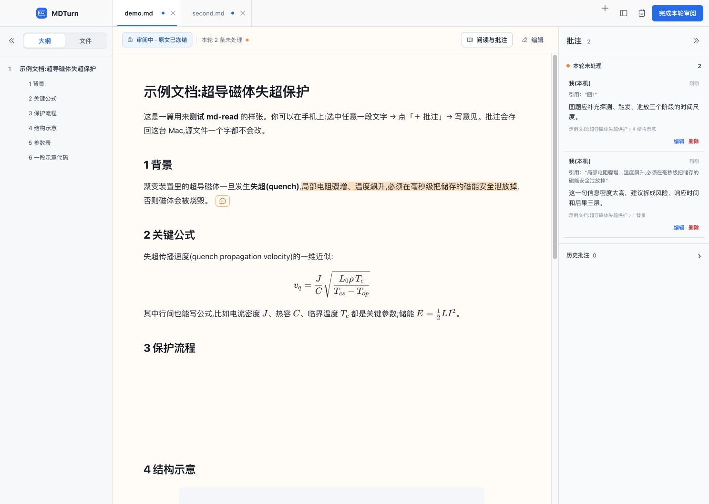

# MDTurn · 本地 Markdown 阅读、批注与编辑

[English](README.en.md) · [贡献指南](CONTRIBUTING.md) · [Windows 移植指引](docs/windows-porting.md)

MDTurn 是一款开源 Markdown 工作台：把阅读与批注放在同一个冻结模式里，
把原文编辑放在独立模式里，并让人和 AI 都能按同一套批注状态安全闭环。
桌面版基于 Electron，支持 **macOS** 与 **Windows 11 x64（Beta，社区贡献，
感谢 [@ArnaudJiang](https://github.com/ArnaudJiang)）**；Windows 说明见
[docs/windows-porting.md](docs/windows-porting.md)，**欢迎继续贡献 Linux 构建**。



当前版本支持：

- 同一窗口多文档标签页，左右栏均可收合；
- 阅读视图正文缩放：触摸板双指捏合，或 Cmd/Ctrl + `=` / `-` / `0`，缩放比例重启后保留；
- 左栏一级/二级标题大纲和最近审阅文件入口；
- 标题、段落、列表、表格和代码块的真实鼠标选区，跨自然段精确高亮；
- 批注新增/修改/删除，可拖动批注框，批注标记贴近选区起点；
- 右栏随窗口宽度自适应，未处理批注最新置顶，历史批注默认折叠；
- 历史批注默认折叠，并从正文中完全隐藏；
- 冻结审阅、版本冲突拦截和 SHA-256 校验；
- 独立 CodeMirror 编辑器、实时预览、草稿恢复和逐条处理批注；
- Agent 改完后通过本机事件主动刷新对应标签；App 在后台时发出 macOS 通知；
- 公式、Mermaid、代码高亮、表格、相对上级路径及绝对本机图片；
- 保留 `mdshare` 手机远程审阅通道。

`md-read` 是 MDTurn 复用的本地审阅服务与 CLI。两条入口共用同一个
`<文档.md>.annotations.json`：

```text
电脑本地：Codex 生成 MD → mdreview open → MDTurn（未安装时回退浏览器）→ 冻结审阅 → Codex 应用批注
手机远程：Codex 生成 MD → mdshare → Cloudflare 链接 → 手机批注 → Codex 应用批注
```

Codex 调用约定：明确说“电脑打开 / 本地审阅”时使用 `mdreview open`；明确说“发我手机 /
给别人看 / 生成分享链接”时使用 `mdshare`；只说“发我看 / 我要批注”而没有说明终端时，
必须先确认电脑本地还是手机远程。

## 电脑本地审阅

```bash
mdreview open "/绝对路径/方案.md"
```

`mdreview open` 会创建或复用该文件的审阅会话、记录 SHA-256 版本指纹，并优先把文档打开到已安装的 MDTurn。未安装 MDTurn 时会自动回退到原有本机浏览器审阅页；两种方式都不经过公网，其他项目可以继续工作。`--no-open` 仍只创建或复用会话，不打开 App 或浏览器。

MDTurn 内部仍使用 loopback HTTP 与现有服务通信；`/desktop`、审阅接口和本地文件接口都会
拒绝 Cloudflare 请求头，不能通过公网 Tunnel 进入。

页面始终在正文上方显示当前状态：

```text
审阅中 · 原文已锁定        可阅读和批注，不能改原文
等待修改 · 批注已提交      已停止批注，等待 Agent 或手工处理
Agent 修改中 · 文档暂时只读  Agent 正在改稿，完成后自动刷新
手工修改中 · 请逐条处理批注  你正在编辑，需将未处理批注清零
修改已完成 · 已加载最新版    本轮结束，可开始下一轮
版本冲突 · 已停止写入        源文件在冻结期间变化，需先处理冲突
```

底层审阅状态仍为 `reviewing → ready_to_apply → applying → complete`；
`applying` 会根据 `applyMode` 在界面上分成“Agent 修改中”和“手工修改中”。
`conflict` 是版本冲突停写，`cancelled` 是人工取消本轮。

源文档在 `reviewing` 期间发生变化时，会话立即进入 `conflict`，旧版本批注不再写入。关闭浏览器不会自动解锁。

审阅中的未处理批注可以在批注列表里继续“编辑”或“删除”；点击“完成本轮审阅”后页面只读。
跨段选择会记录完整起止行，并高亮覆盖的全部段落；旧版本已经保存成错误单行范围的长批注，
页面也会根据引用正文做兼容显示，但不会偷偷改写历史 sidecar。

Agent 执行 `mdreview complete` 后会主动通知正在运行的 MDTurn，不需要高频轮询。
前端仅保留 60 秒一次的轻量状态核对，用于 App 断网、睡眠或错过事件后的容错；
它不会定时重载整篇正文。未保存草稿存在时，远程更新会被挂起而不是覆盖草稿。

常用恢复/Agent 命令：

```bash
mdreview status "/绝对路径/方案.md" --json
mdreview begin-apply "/绝对路径/方案.md"
mdreview complete "/绝对路径/方案.md"
mdreview unlock "/绝对路径/方案.md" --reason "放弃本轮审阅"
```

## 手机远程审阅

```bash
mdshare "/绝对路径/方案.md"
mdshare "/绝对路径/方案.md" --for 小王 --days 3
```

命令最后一行是可直接发送的链接。每条记录有独立 ID/token，可设置有效期；批注仍写回源文件旁的 sidecar。

远程入口目前使用 Cloudflare Quick Tunnel。Tunnel 重连会更换域名，因此完整旧链接可能失效；页面会提示重新生成链接。固定公网域名不属于本版本。

## 常驻服务

本机通过 launchd 的 `com.mdread.serve` 自动运行 `serve-daemon.sh`，启动 Node 服务并维护 Cloudflare Tunnel。`serve.command` 是手工备用启动器。

服务默认只监听 `127.0.0.1`，不提供本地目录浏览；Cloudflare 只能访问带有效 `d/k` 的分享文档。实际端口写入 `.mdread/port`，CLI 不再写死 8080。

## 按批注改稿

本地冻结审阅必须先由用户点击“完成本轮审阅”。Agent 随后：

1. 运行 `mdreview status`，确认状态；
2. `ready_to_apply` 时运行 `mdreview begin-apply`；
3. 只处理 `status=open` 的批注，以 `quote + headingPath` 定位；
4. 改完标记 `applied/wontfix`，保留审计字段；
5. 全部 open 清零后运行 `mdreview complete`。

没有审阅会话的旧 sidecar 继续遵守原有 `open → applied/wontfix` 协议。

## 数据与可靠性

- `.mdread/registry.json`：远程分享记录。
- `.mdread/reviews.json`：本地审阅会话与冻结状态。
- `.mdread/port`：当前本地服务端口。
- `<文档.md>.annotations.json`：批注正文，兼容旧格式。
- 批注修改会保留原创建记录，并追加 `updatedAt / updatedBy / editCount` 审计字段。
- JSON 写入采用跨进程锁、锁内重读、临时文件和原子替换；已有 JSON 损坏时停止写入，不会按空数据覆盖。
- `.mdread` 权限为 `0700`，其中凭证和索引文件为 `0600`。
- 未保存的 MDTurn 编辑草稿按 `reviewSessionId + sourceHash` 保存在 App 本地存储中；刷新或异常重开时只恢复匹配版本的草稿。

## 开发、验证与打包

后端只使用 Node 内置模块。桌面壳依赖全部固定版本并记录在 `desktop/package-lock.json`：

```bash
npm --prefix desktop install --cache desktop/.npm-cache
npm --prefix desktop run build:vendor
```

完整测试：

```bash
node --test test/*.test.js
node test/desktop-production-smoke.js
MDTURN_SMOKE_WIDTH=980 node test/desktop-production-smoke.js
npm --prefix desktop test
node --check server.js
node --check mdshare.js
node --check mdreview.js
```

生成 macOS arm64 App：

```bash
npm --prefix desktop run dist:app
```

当前构建使用 ad-hoc 签名，适合本机安装和早期开源试用；正式公开下载前还需要 Apple Developer ID
签名与 notarization。

生成 Windows 11 x64 安装包（需在 Windows 上构建）：

```powershell
npm --prefix desktop run dist:win
```

产物为 `desktop/dist/MDTurn-<版本>-x64.exe`（NSIS 安装器，支持自选目录、快捷方式、
卸载和 `.md` 文件关联）。目前**尚未提供预构建安装包下载**，需要从源码自行构建；
Windows Beta 未做代码签名，安装时 SmartScreen 显示"未知发布者"属预期。
Windows 版覆盖完整的本地审阅闭环，暂不含手机分享、自动更新与 ARM64，
边界详见 [docs/windows-porting.md](docs/windows-porting.md)。

## 参与贡献

欢迎 Issue 与 PR，流程与代码约定见 [CONTRIBUTING.md](CONTRIBUTING.md)。
Windows 11 x64 支持由 [@ArnaudJiang](https://github.com/ArnaudJiang) 贡献
（[PR #1](https://github.com/LongjunQin/mdturn/pull/1)），在此致谢。
当前最想要的贡献是 **Linux 版**（同一套 Electron 壳，工作量与 Windows 移植类似），
以及 Windows 侧的代码签名、自动更新与干净环境验证。

## 开源许可

MDTurn 使用 [MIT License](LICENSE)。界面图标来自
[Phosphor Icons](https://phosphoricons.com/)（MIT）；编辑器使用
[CodeMirror](https://codemirror.net/)（MIT）；渲染依赖
[markdown-it](https://github.com/markdown-it/markdown-it)（MIT）、
[KaTeX](https://katex.org/)（MIT）、[Mermaid](https://mermaid.js.org/)（MIT）、
[highlight.js](https://highlightjs.org/)（BSD-3-Clause）、
[markdown-it-texmath](https://github.com/goessner/markdown-it-texmath)（MIT）。以上第三方库的许可证文本
随各自发行版分发，向仓库引入新依赖时请保持许可证兼容（MIT/BSD/Apache 类）。
