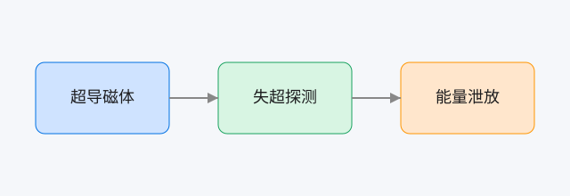

# 示例文档:超导磁体失超保护

这是一篇用来**测试 md-read** 的样张。你可以在手机上:选中任意一段文字 → 点「＋ 批注」→ 写意见。批注会存回这台 Mac,源文件一个字都不会改。

## 1 背景

聚变装置里的超导磁体一旦发生**失超(quench)**,局部电阻骤增、温度飙升,必须在毫秒级把储存的磁能安全泄放掉,否则磁体会被烧毁。

## 2 关键公式

失超传播速度(quench propagation velocity)的一维近似:

$$v_{q} = \frac{J}{C}\sqrt{\frac{L_0 \rho \, T_c}{T_{cs}-T_{op}}}$$

其中行间也能写公式,比如电流密度 $J$、热容 $C$、临界温度 $T_c$ 都是关键参数;储能 $E = \tfrac{1}{2} L I^2$。

## 3 保护流程


## 4 结构示意



**图1** 失超保护三段链路:探测 → 触发 → 泄放。(试试对"图1"这三个字做批注,告诉模型这张图哪里要改)

## 5 参数表

| 参数 | 符号 | 量级 |
|---|---|---|
| 工作温度 | $T_{op}$ | 4.2 K |
| 临界温度 | $T_c$ | 9.2 K (NbTi) |
| 泄放时间常数 | $\tau$ | ~10 s |

## 6 一段示意代码

```python
def quench_detected(v_threshold, v_now):
    return v_now > v_threshold  # 超过阈值即触发泄放
```
